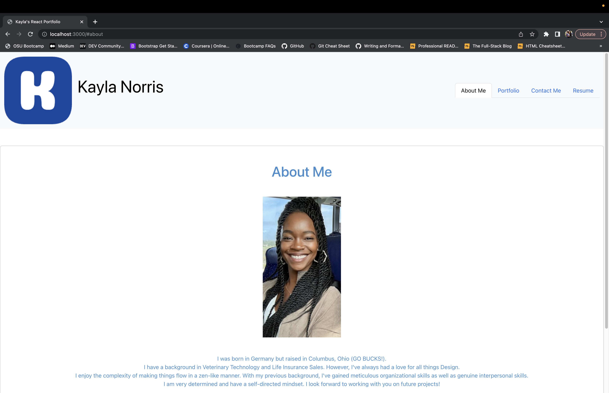
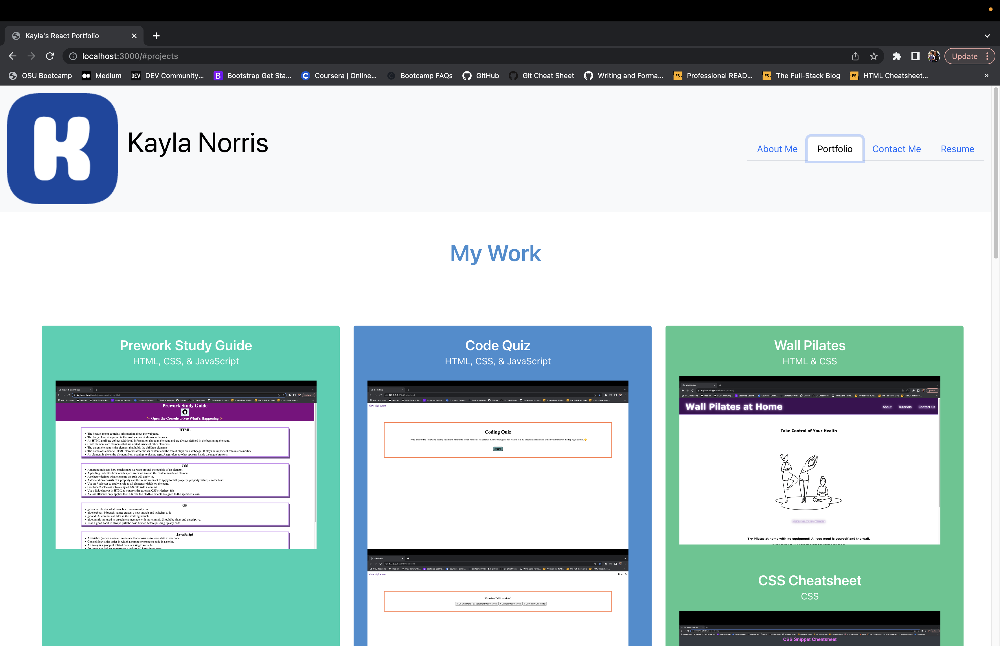
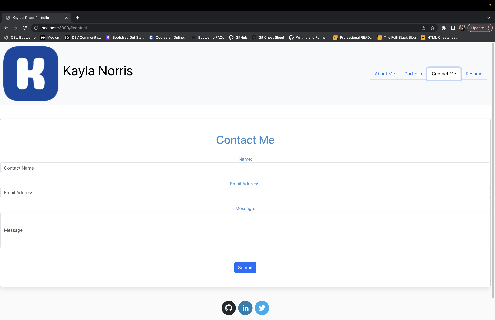
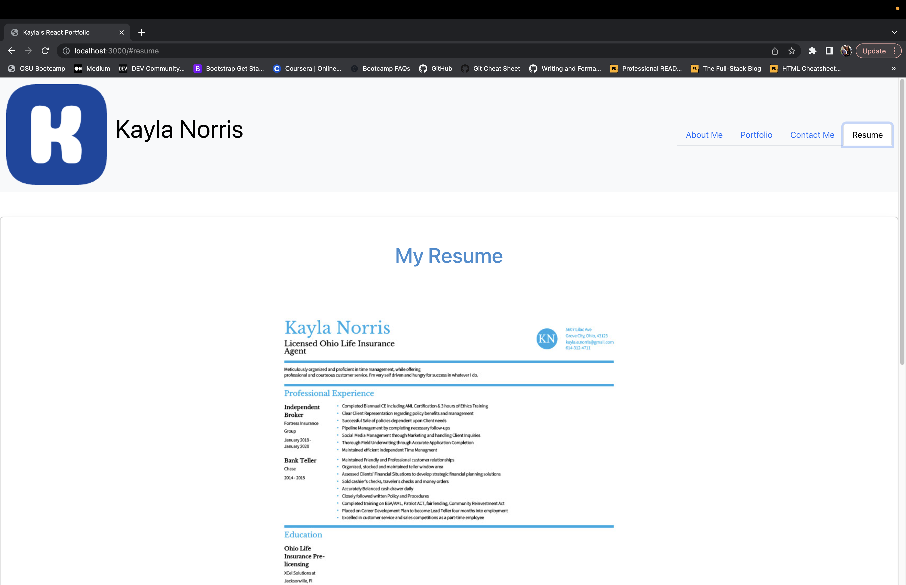

# react-portfolio

## Description
The purpose of this project was to update my portfolio site with React technology. This application can be used to showcase my work while also showing my proficiency with building single page applications. The application also has a contact form that allows users to send me a message along with their email address so I can respond. I also included my GitHub, LinkedIn, and Twitter accounts in the footer to enable users to contact me in various ways.  

## Table of Contents
- [react-portfolio](#react-portfolio)
  - [Description](#description)
  - [Table of Contents](#table-of-contents)
  - [Installation](#installation)
  - [Usage](#usage)
  - [About Me Screenshot](#about-me-screenshot)
  - [Portfolio Screenshot](#portfolio-screenshot)
  - [Contact Me Screenshot](#contact-me-screenshot)
  - [Resume Screenshot](#resume-screenshot)
  - [License](#license)
  - [Questions](#questions)
  - [Credits](#credits)
## Installation

n/a

## Usage

The intended use of this application is for potential employers and/or co-contributers to view my work and contact me. 

## About Me Screenshot

## Portfolio Screenshot

## Contact Me Screenshot

## Resume Screenshot

## License

  
Please refer to the LICENSE file in the repo.

## Questions

For more information, please contact me on [GitHub](https://github.com/KaylaNorris) 
or email me at kayla.e.norris@gmail.com

## Credits
Favicon generated via https://redketchup.io/favicon-generator